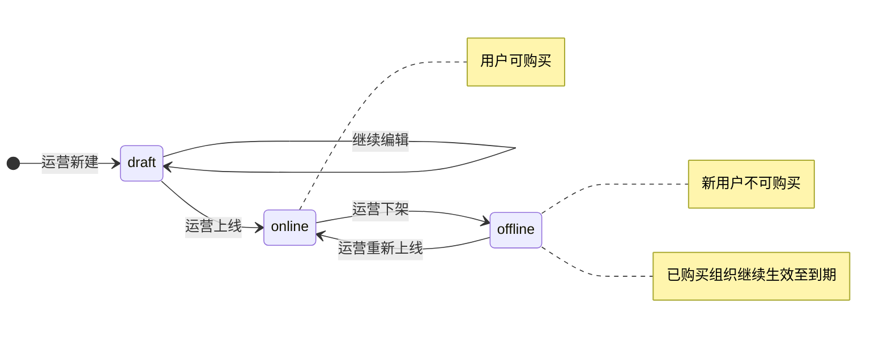
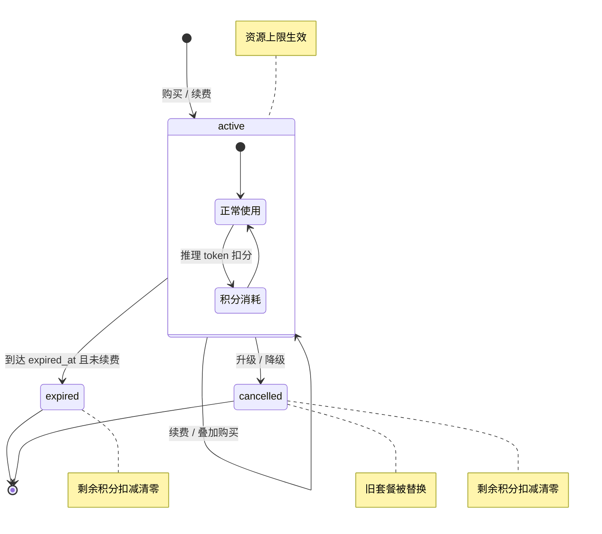
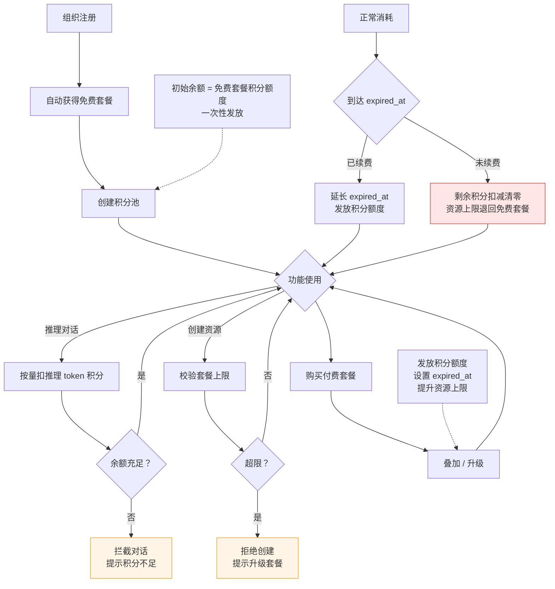
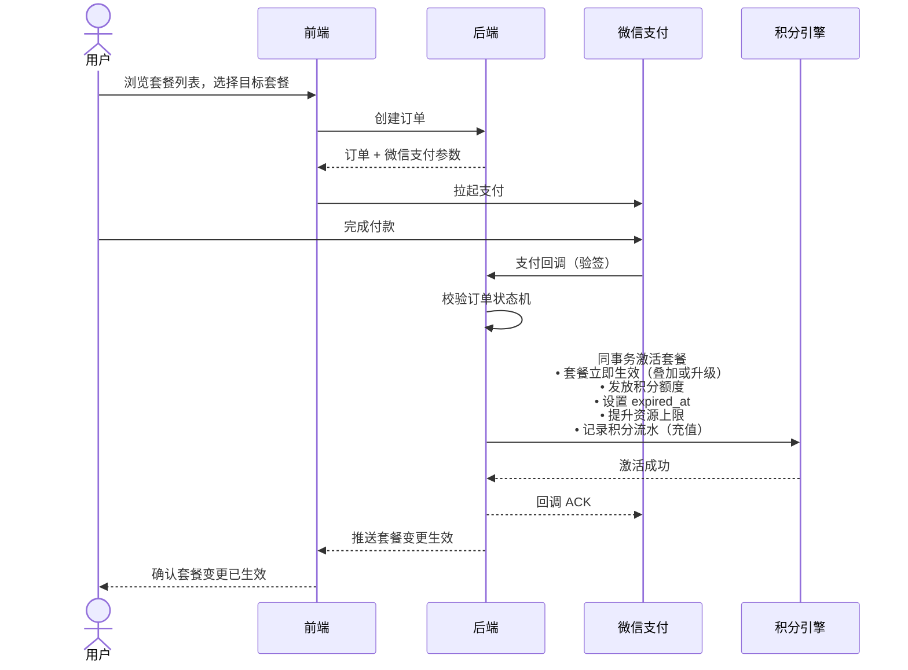
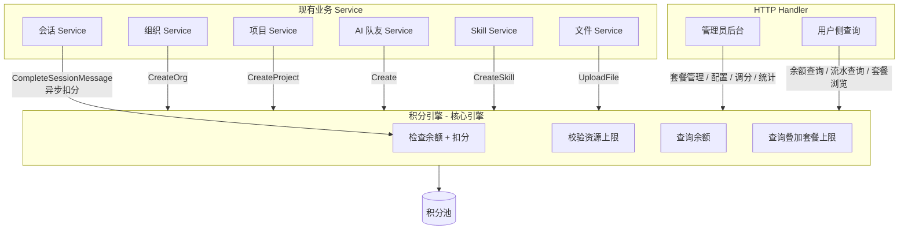
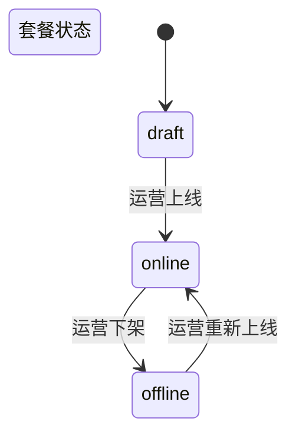
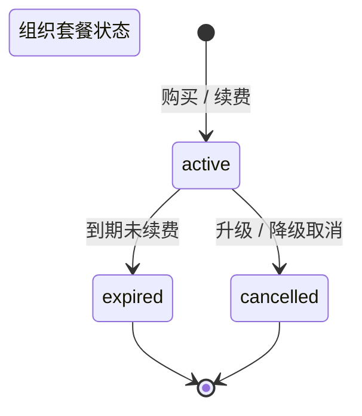
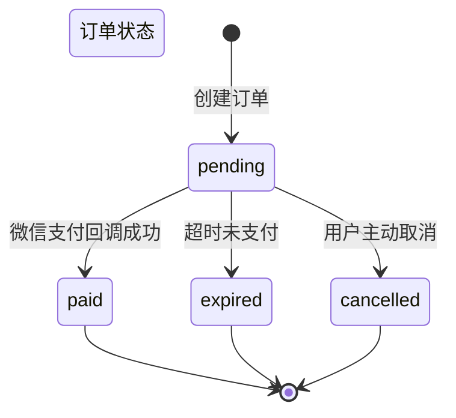

# 积分系统 — 产品需求文档

> 状态：草案待评审
> 日期：2026-07-09
> 范围：全栈（`backend/` + `frontend/`）
> 技术设计详见：[points-system-tech-design.md](./points-system-tech-design.md)

---

## 1. 执行摘要

**问题陈述：** Lework 当前作为 AI 协作平台承担了真实的推理、存储、AI 队友执行等资源成本，却完全没有任何计量与计费能力——组织无配额概念、功能无使用限制、token 用量仅作展示。平台既无法控制成本上沿，也无法形成可持续的商业化路径。

**套餐陈述：** 建立以"积分"为统一内部价值单位的计量计费体系。组织按套餐获得积分额度，推理 token 按量实时扣分；项目/成员/AI 队友/Skill/可创建组织数/文件存储等资源受套餐硬上限约束，创建前校验是否超限。付费套餐按月订阅，每周期发放对应积分额度，到期未续费则当周期未消耗积分一次性清零。余额不足或超限即限制使用。运营通过套餐定价、资源上限与消耗项单价实现完整的商业化闭环。

**系统能力清单（务实的成功标准）：**

| 能力 | 说明 |
|------|------|
| 积分余额实时可见 | 组织管理员可随时查看当前余额、本月消耗、本月收入、累计消耗 |
| 消耗明细可追溯 | 所有积分变动有流水记录，支持按时间范围、消耗项类型筛选 |
| 消耗占比可分析 | 按消耗项分类的消耗占比可见，便于管理员掌握资源使用分布 |
| 资源上限可查询 | 管理员可查看当前生效套餐对应的各资源硬上限 |
| 系统级运营统计 | 运营可见活跃付费组织数、套餐分布、全平台消耗趋势、每组织平均消耗 |
| 拦截可感知 | 积分不足时用户收到明确提示；运营可见拦截情况，便于调整定价策略 |

---

## 2. 用户角色

| 角色 | 在积分系统中的作用 |
|------|-------------------|
| **运营人员** | 配置套餐套餐（档位、价格、积分额度、资源上限）；配置各消耗项积分单价；手动调整组织积分余额（处理客诉、补偿、活动发放）；查看系统级运营统计 |
| **组织管理员** | 为组织购买/升级套餐；查看积分余额与消耗明细；查看当前资源上限；在积分不足时收到升级引导 |
| **组织成员** | 使用平台功能时消耗所在组织的积分；积分不足时收到明确提示，联系管理员处理 |
| **系统** | 积分不足时拦截操作并保护已完成的内容（如已生成的对话消息不丢失） |

---

## 3. 功能范围

### 3.1 第一期包含

| 模块 | 内容 |
|------|------|
| 积分引擎 | 积分池管理、实时扣分、余额检查 |
| 套餐管理 | 套餐增删改查、组织套餐关联、套餐叠加与资源上限聚合、资源上限校验 |
| 支付购买 | 接入微信支付；付费套餐按月订阅，用户自助购买（创建订单 → 微信支付 → 自动激活）；到期需手动续费 |
| 推理 token 计费 | 会话消息完成后，按运营配置单价将推理 token 换算为积分扣除 |
| 资源上限管理 | 项目/成员/AI 队友/Skill/可创建组织数/文件存储受套餐硬上限约束，创建/上传前校验是否超限 |
| 新组织创建 | 用户可创建新的独立组织，各组织间无从属关系、积分完全独立 |
| 积分流水 | 所有积分变动的完整审计日志 |
| 管理员功能 | 套餐增删改、消耗项单价配置、手动调分、组织维度和系统维度统计 |
| 前端展示 | 积分余额、消耗明细、套餐信息、套餐选择与购买、积分不足提示、资源超限提示 |

### 3.2 不包含（后续版本）

- **套餐自动续费** — 套餐到期后不自动扣款续费，需用户主动续费
- **折扣/优惠券** — 不支持积分折扣、优惠码、促销活动等机制
- **多币种结算** — 仅支持人民币计价
- **账单与发票** — 不提供发票开具、月度账单自动生成
- **差异化/阶梯定价** — 同一消耗项对所有组织采用相同单价，不做阶梯计价或大客户差异化定价
- **积分赠送/转让** — 组织之间不可转移积分，组织内用户之间不可转让积分
- **其他支付渠道** — 第一期仅接入微信支付，支付宝、企业转账等其他渠道后续版本扩展

---

## 4. 核心概念与原则

### 4.1 核心概念

| 概念 | 说明 |
|------|------|
| **积分** | 平台统一的内部价值单位，由运营定价，用于计量所有功能消耗 |
| **积分池** | 每个组织拥有一个积分池，记录累计获得、已消耗的积分总量 |
| **套餐** | 预定义的定价档位，定义积分额度和各类资源的硬上限 |
| **消耗项** | 所有可计量的功能资源，每种有独立的积分单价 |
| **积分流水** | 所有积分变动的审计记录，可追溯和对账 |

### 4.2 核心原则

- **组织共享** — 一个组织共享一个积分池和一套生效套餐，组织内所有成员共同消耗同一池子
- **组织隔离** — 各组织的积分池完全独立，组织间互不共享、不可转移积分
- **异步扣分** — 推理 token 在消息完成后异步扣除积分。目的是不打断问答流程：对话开始时仅检查余额不为零，允许问答完整进行，完成后统一结算扣除。因此可能出现少量超支（余额不足以覆盖整轮问答的 token 消耗），此为产品有意的体验取舍
- **一次性发放** — 所有套餐购买后一次性发放积分额度到积分池，无周期发放机制；到期未续费则剩余积分一次性扣减清零并写入流水；续费延长到期时间并发放积分；免费套餐为一次性发放
- **硬限制** — 资源超限（项目/成员/AI 队友/Skill）在创建前同步校验，不通过则拒绝创建。token 消耗默认为异步扣分，余额为零时阻止新对话，但正在进行的问答不中断
- **运营定价** — 积分与人民币的换算、各消耗项单价均由运营配置决定，不在代码中硬编码

---

## 5. 套餐体系

### 5.1 套餐定义

套餐是面向用户的最小商业化档位单元。组织通过购买或免费获得套餐，套餐提供：

1. **积分额度** — 购买套餐后一次性发放到积分池的积分数量。付费套餐到期后剩余积分扣减清零，免费套餐一次性发放
2. **资源硬上限** — 各类资源的数量上限（如项目数、成员数、AI 队友数等）
3. **到期时间** — 付费套餐订阅有显式到期时间（`expired_at`），按套餐周期计算（购买时刻 + 周期时长）；续费延长到期时间（现 `expired_at` + 周期时长）。免费套餐无到期时间

套餐有三种状态：草稿（`draft`，运营内部编辑中，对用户不可见）、上线（`online`，用户可购买）、下架（`offline`，新用户不可购买，已购买组织继续生效至到期）。

### 5.2 三档套餐示例矩阵

> 以下为示意档位，具体数值以运营最终配置为准。

| 维度 | 免费版 | 专业版 | 企业版 |
|------|--------|--------|--------|
| 价格 | ¥0 | ¥99/月 | ¥499/月 |
| 积分额度 | 10,000（一次性） | 100,000（一次性） | 1,000,000（一次性） |
| 项目数上限 | 5 | 50 | 不限 |
| 成员数上限 | 10 | 100 | 不限 |
| AI 队友数上限 | 3 | 20 | 不限 |
| Skill 数上限 | 5 | 50 | 不限 |
| 存储空间上限 | 1 GB | 10 GB | 100 GB |
| 周期类型 | 一次性 | 按月订阅 | 按月订阅 |

### 5.3 套餐叠加规则

> **不在本期范围内。** 套餐叠加（一个组织同时持有多个生效套餐）为后续版本功能，第一期仅支持单一生效套餐。

### 5.4 升级/降级

> **已知问题：升级/降级差价损失** — 当前设计中，升级或降级时旧套餐被直接取消，已付费用中剩余周期的价值不退不折算。例如用户已付 80 元购买基础套餐（10 万积分/月），未到期时再付 160 元购买升级套餐（100 万积分/月），实际共付 240 元，但基础套餐剩余周期的已付费用完全损失。此问题在后续版本中解决。

### 5.4 套餐生命周期（用户感知）

**套餐状态流转：**

**组织套餐主体生命周期：**

| 场景 | 用户感知 |
|------|---------|
| **首次注册** | 自动获得免费套餐，立即一次性发放免费积分额度，可开始使用 |
| **购买新套餐** | 新套餐立即生效，替换现有套餐；按当前周期发放新套餐积分额度，并设置 `expired_at`（购买时刻 + 周期时长）；资源上限按新套餐取值 |
| **升级套餐** | 旧套餐失效（剩余积分扣减清零），新套餐生效；发放新套餐积分额度并重设 `expired_at` |
| **降级套餐** | 用户选择更低档套餐并完成支付后：旧套餐失效（剩余积分扣减清零），新套餐生效；发放新套餐积分额度并重设 `expired_at`；已有资源完整保留不删除；超出新套餐上限的资源类型不再允许新建 |
| **续费套餐** | 延长 `expired_at`（现 `expired_at` + 周期时长），发放积分额度；已清零的历史积分不追溯 |
| **到期未续费** | 到达 `expired_at` 时刻且未续费：剩余积分一次性扣减清零并写入流水；资源硬上限退回免费套餐水平；已有资源保留但不可再新建超限资源。清零由定时任务执行（每日凌晨 3:00），`expired_at` 时刻至清零执行时刻之间可能存在短暂延迟，该窗口内用户仍可使用积分，但最迟在次日凌晨完成清零 |

**降级后的数据保护原则：** 降级不会删除任何已有数据。已超出新套餐上限的资源类型只是不能再新建，已有资源正常可用。例如从专业版（50 项目）降级到免费版（5 项目），但已有 30 个项目 → 30 个项目正常使用，只是无法再创建第 31 个。

---

## 6. 消耗项与资源上限

积分系统对资源的管理分两种模式：

- **积分计费型** — 按实际使用量实时扣分（仅推理 token）
- **上限约束型** — 仅校验是否超出套餐上限，不扣分（项目/成员/AI 队友/Skill/文件存储）

### 6.1 积分计费项清单

| 消耗项 | 计量单位 | 用户感知 |
|--------|---------|---------|
| 推理输入 token | 每 1000 token | 每次 AI 对话的输入按量计费 |
| 推理输出 token | 每 1000 token | 每次 AI 对话的输出按量计费 |
| 推理缓存输入 token | 每 1000 token | 命中缓存的输入可按折扣价计费 |
| 推理缓存输出 token | 每 1000 token | 命中缓存的输出可按折扣价计费 |

> **备注：** 计费项按输入/输出/缓存细分仅用于运营定价与内部成本核算，对最终用户不体现输入、输出、缓存的区分，用户侧仅感知统一的 token 消耗量。

### 6.2 资源上限清单

| 资源 | 套餐字段 | 校验时机 | 用户感知 |
|------|---------|---------|---------|
| 项目 | `max_projects` | 创建项目前 | 超出上限时拒绝创建，提示升级套餐 |
| 成员 | `max_employees` | 添加成员前 | 超出上限时拒绝添加，提示升级套餐 |
| AI 队友 | `max_ai_teammates` | 创建 AI 队友前 | 超出上限时拒绝创建，提示升级套餐 |
| Skill | `max_skills` | 创建/安装 Skill 前 | 超出上限时拒绝创建，提示升级套餐 |
| 文件存储 | `max_storage_bytes` | 上传文件前 | 超出总量上限时拒绝上传，提示升级套餐或清理文件 |

### 6.2.1 待定约束

> **TODO：可创建组织数约束规则待定。** 每个用户/组织可创建的组织数量需独立约束，但约束规则（按用户维度限制还是其他维度、与套餐的关系、边界值等）尚未确定，不纳入当前套餐资源上限体系。

### 6.3 推理 token 计量规则

推理 token 消耗在会话消息完成时触发，按运营配置的单价换算积分。具体规则：

- 输入 token、输出 token、缓存命中输入 token、缓存命中输出 token **分别独立计价**
- 缓存命中部分可配置为折扣价（鼓励提升缓存命中率以降低成本）
- 单价单位为"积分 / 1000 token"，由运营在消耗项配置中维护
- 换算公式与具体实现详见[技术设计文档](./points-system-tech-design.md)

---

## 7. 关键业务流程（用户视角）

### 7.1 组织积分池生命周期

### 7.2 套餐购买流程

### 7.3 新组织创建规则

- 用户可创建新的独立组织，新组织与当前用户所属组织**无从属关系**，不存在谁管理谁
- 新组织自动关联免费套餐
- 新组织获得独立的积分池，初始余额为免费套餐积分额度
- 各组织间积分池完全独立，不可共享、不可转移

> **TODO：** 新组织创建的约束规则待定——是否限制每个用户可创建的组织数量、上限值、校验逻辑等尚未确定。详见 [6.2.1 待定约束](#621-待定约束)。

---

## 8. 技术边界

> 本节为高层技术边界，具体数据模型、SQL、代码实现详见[技术设计文档](./points-system-tech-design.md)。

### 8.1 架构概述

积分引擎作为后端 Service 层的横向组件，被现有业务 Service 调用，不直接暴露 HTTP 路由给用户。

独立的 HTTP Handler 仅暴露给**管理员后台**和**用户侧查询接口**（套餐浏览、余额查询、流水查询），核心扣分逻辑通过 Service 间调用完成。

### 8.2 集成边界

积分引擎接入以下现有 Service：

| 现有 Service | 集成点 | 时机 |
|-------------|--------|------|
| 组织 Service | `CreateOrg` | 组织创建后初始化积分池 |
| 项目 Service | `CreateProject` | 创建前校验项目数上限 |
| 会话 Service | `CompleteSessionMessage` | 消息完成后异步扣推理 token 积分 |
| AI 队友 Service | `Create` | 创建前校验 AI 队友数上限 |
| Skill Service | `CreateSkill` | 创建/安装前校验 Skill 数上限 |
| 文件 Service | `UploadFile` | 上传前校验存储空间上限 |

**关键原则：**
- 资源创建前校验套餐上限与组织现有资源数；超限拒绝创建并提示用户升级套餐
- 推理 token 消耗为异步扣分，不阻塞消息完成流程；扣分失败时消息内容仍保留
- 所有集成点的详细实现（含代码片段）见技术设计文档

### 8.3 安全与数据保护

| 维度 | 要求 |
|------|------|
| **数据隔离** | 积分池、流水按 `org_id` 严格隔离，组织 A 不可查询/影响组织 B 的积分数据 |
| **操作审计** | 所有积分变动（扣分/周期发放/到期清零/调整）记录流水，含操作前后余额，支持对账 |
| **权限控制** | 套餐管理、单价配置、手动调分仅运营人员可操作；余额查询、流水查询仅组织管理员可操作 |
| **支付安全** | 通过微信支付官方回调确认支付状态，订单激活依赖支付回调验签；支付回调与套餐激活在同一事务内完成，避免伪造回调 |
| **敏感数据** | 积分余额、消耗明细属于组织敏感经营数据，需遵循平台数据安全规范（脱敏、访问控制） |
| **防滥用** | 防并发超扣；套餐叠加查询走聚合接口避免漏判上限 |

---

## 9. 前端交互概览

> 本节描述关键页面与用户感知，不涉及具体界面设计。

### 9.1 关键页面

| 页面 | 定位 | 核心内容 |
|------|------|---------|
| **套餐选择页** | 组织管理员可见 | 三档套餐对比矩阵、当前套餐标注、购买/升级入口 |
| **积分中心** | 组织管理员可见 | 当前余额、本月消耗、本月收入、套餐到期时间、按消耗项分类的消耗占比 |
| **消耗明细页** | 组织管理员可见 | 积分流水列表，支持时间范围/消耗项类型筛选，含时间、类型、积分数、余额、描述 |
| **运营套餐管理** | 运营人员可见 | 套餐增删改、消耗项单价配置、手动调分、组织维度统计 |
| **积分不足提示** | 全量用户可见 | 弹窗/横幅提示，管理员含升级入口，普通成员含"联系管理员"引导 |
| **资源超限提示** | 全量用户可见 | 创建资源被套餐上限拦截时提示，管理员含升级入口，普通成员含"联系管理员"引导 |

### 9.2 关键状态的用户感知

| 状态 | 用户感知 |
|------|---------|
| **余额充足** | 功能正常使用，后台首页可看到实时余额 |
| **余额不足** | 触发拦截的操作提示"积分不足"，管理员看到升级引导，普通成员看到联系管理员 |
| **资源超限** | 创建资源被套餐上限拦截，提示"已达上限"并引导升级套餐 |
| **套餐到期** | 付费套餐到期后积分清零，资源上限退回免费套餐水平，提示续费 |
| **套餐降级** | 已有资源完整可用，超出新上限的资源类型不可新建，后台显示当前实际生效的套餐与上限 |

### 9.3 信息架构要点

- 余额信息在管理员后台首页显著展示，每次消耗后实时刷新
- 消耗明细支持可导出（便于企业财务对账，未来版本）
- 套餐对比矩阵需直观呈现"当前套餐 vs 目标套餐"的差异
- 积分不足提示需区分场景：对话场景下不打断已生成的消息，仅限制后续操作
- 资源超限提示需包含当前上限与已有数量，便于用户判断是清理还是升级

---

## 10. 积分不足与资源超限体验

### 10.1 体验

**积分不足：**
- 所有需要积分的接口返回统一的"积分不足"错误标识
- 接口响应携带当前积分余额，前端可展示
- 推理 token 消耗失败时不影响已生成的消息内容（消息已保存，仅后续操作受限）

**资源超限：**
- 创建资源被套餐上限拦截的接口返回统一的"资源超限"错误标识
- 接口响应携带当前上限与已有数量，前端可展示

**前端体验（两者通用）：**
- 组织管理员：明确的提示 + 套餐购买/升级引导
- 普通成员：提示"请联系管理员"
- 不出现裸露的错误码或技术性错误信息

### 10.2 积分统计

**组织维度（管理员可见）：**

| 指标 | 说明 |
|------|------|
| 当前余额 | 积分池实时余额 |
| 本月消耗 | 当月所有消耗类型流水总和 |
| 本月收入 | 当月充值和周期发放类型流水总和 |
| 累计消耗 | 全部消耗类型流水总和 |
| 按消耗项分类 | 各消耗项类型的消耗占比 |

**系统维度（运营可见）：**

| 指标 | 说明 |
|------|------|
| 活跃付费组织数 | 当月有积分消耗的付费组织数 |
| 套餐分布 | 各套餐已激活的组织数 |
| 全平台积分消耗趋势 | 按月统计的积分消耗量 |
| 每组织平均消耗 | 全平台每组织平均积分消耗量 |

---

## 11. 风险与缓解

| 风险 | 影响 | 概率 | 缓解策略 |
|------|------|------|---------|
| **异步扣分导致超用** | 为确保问答流程不被打断，token 扣分采用"先消费后结算"模式——问答开始时仅检查余额不为零即放行，整轮问答完成后再统一扣分。当余额不足以覆盖整轮问答的 token 消耗时，最终抵扣后余额可能变负，产生少量超支 | 中 | 问答开始前检查余额为零则直接拒绝，不为零则允许完成；扣分后余额变负时消息内容保留不丢失；监控超支情况，token 单价低，单次超支金额有限 |
| **推理成本波动** | 模型切换或上游调价导致平台实际付出的成本与积分定价脱节，赚少或亏钱 | 中 | 运营可随时调整推理 token 的积分单价；每月对账，收入覆盖不了成本时及时调价 |
| **升级/降级差价损失** | 升级或降级时旧套餐剩余周期的已付费用不退不折算，用户感觉"钱白花了"，可能引发投诉或付费意愿下降 | 中 | 后续版本解决，如按剩余天数折价抵扣等方案 |

---

## 附录：状态索引

| 实体 | 状态值 | 中文含义 |
|------|--------|---------|
| 套餐 | `draft` / `online` / `offline` | 草稿 / 上线 / 下架 |
| 组织套餐 | `active` / `expired` / `cancelled` | 生效 / 到期 / 取消 |
| 订单 | `pending` / `paid` / `expired` / `cancelled` | 待支付 / 已支付 / 过期 / 取消 |
| 积分流水类型 | `topup` / `consumption` / `expiration` / `adjustment` | 充值 / 消耗 / 到期清零 / 手动调整 |

**套餐状态流转图：**

**组织套餐状态流转图：**

**订单状态流转图：**

