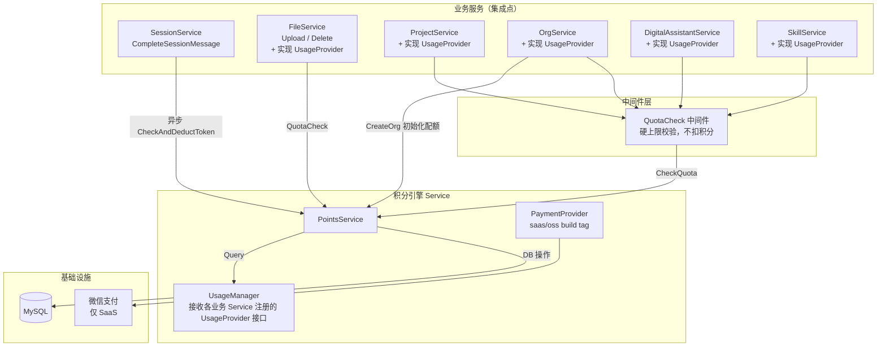
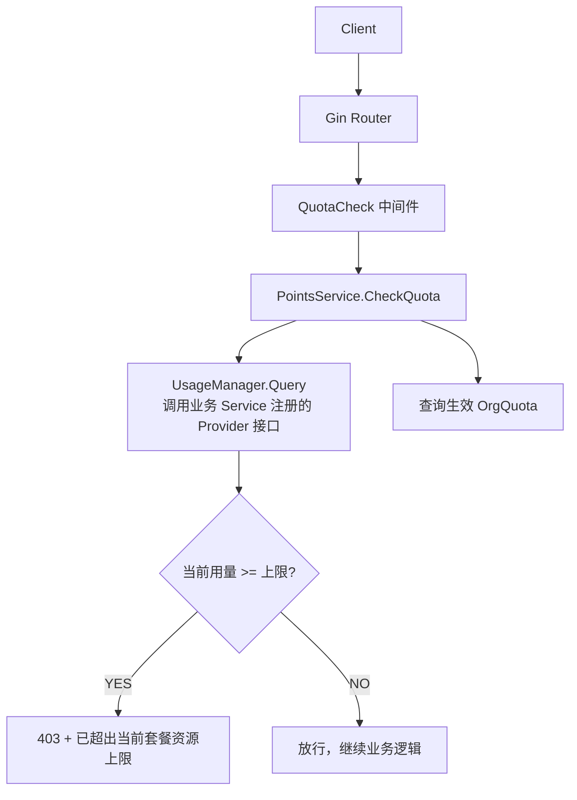
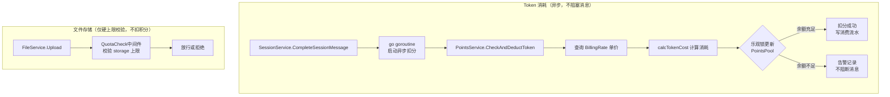
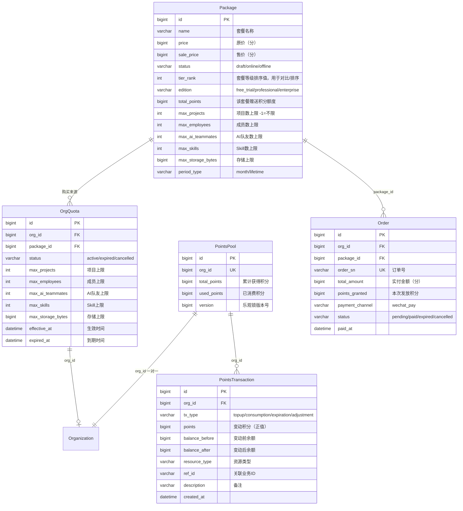
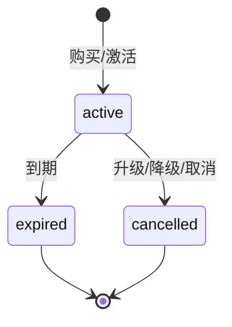
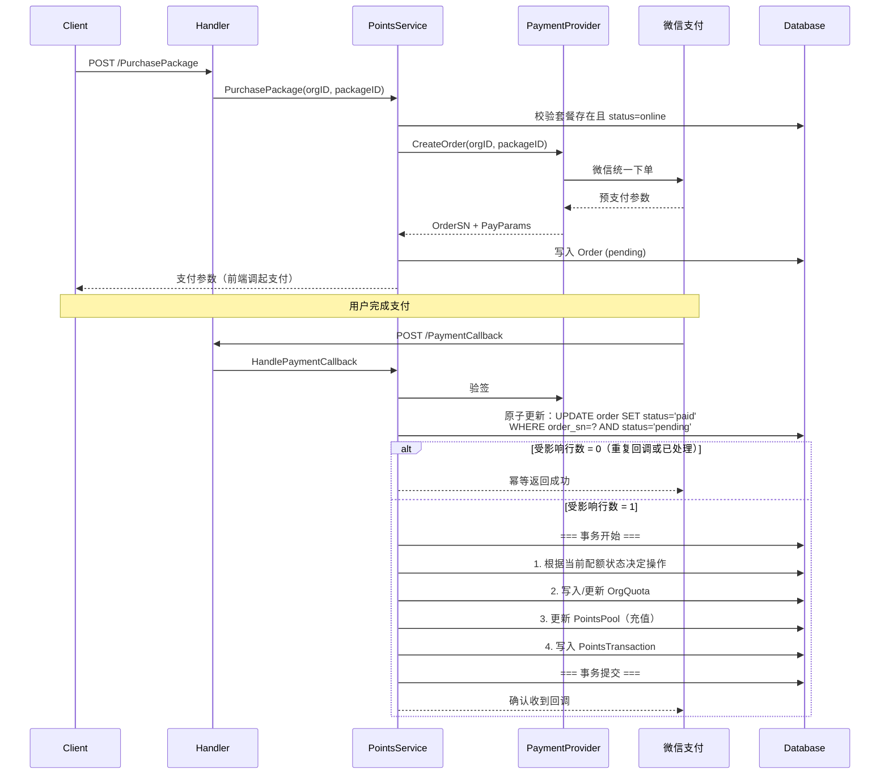
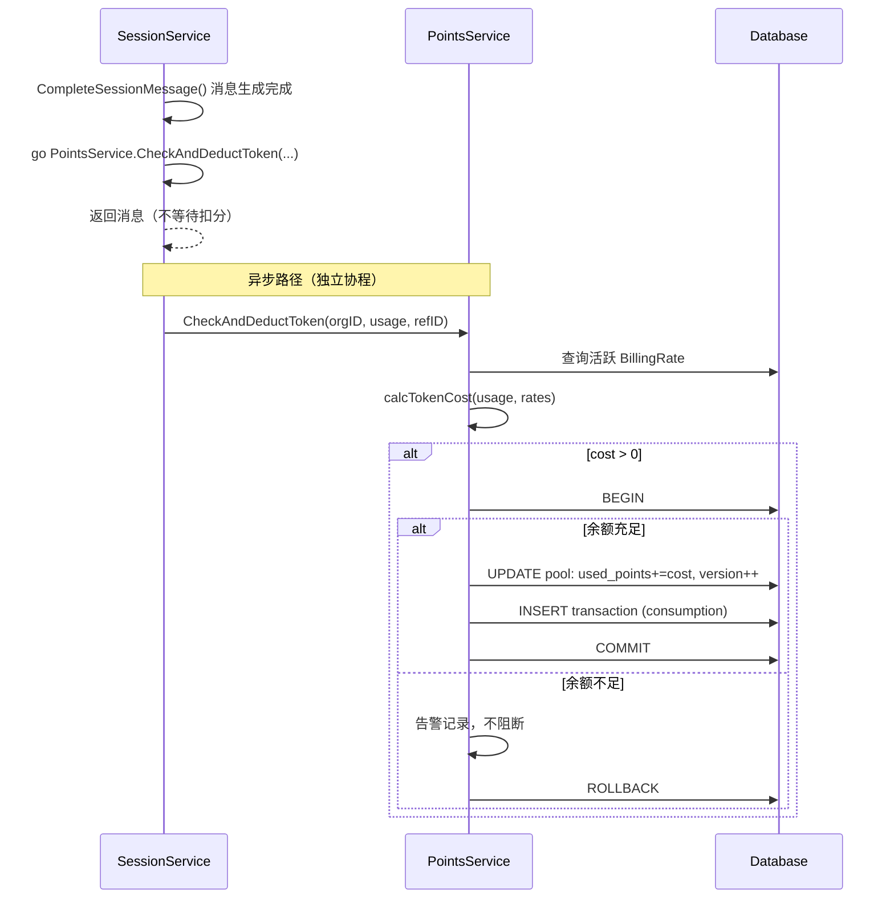

# 积分系统 — 技术方案

> 状态：草案待评审
> 日期：2026-07-09
> 范围：后端（`backend/`）

---

## 1. 背景与目标

### 1.1 业务背景

Lework 当前缺少统一的资源管控体系——组织内项目数、成员数、AI 队友数、Skill 数、LLM token 消耗、文件存储等资源没有配额约束，也无法区分免费用户与付费用户的差异化权益。带来以下问题：

1. **无法商业化**：缺少套餐体系和支付链路，无法将产品能力转化为收入
2. **资源滥用风险**：单一组织可以无限制创建资源，影响多租户平台的稳定性和公平性
3. **运维不可控**：LLM token 消耗和存储用量没有计量和限制，成本黑洞

积分系统的核心目标是将上述资源抽象为可计量的「积分」，通过**套餐 + 硬上限 + 积分**三层模型，实现资源管控与商业化闭环。

### 1.2 一期范围

**本期交付：**

- 套餐体系：免费版 / 专业版 / 企业版三档套餐，含积分额度与资源硬上限
- 积分池：组织级积分池，支持购买/续费充值、token 自动扣分；所有套餐统一一次性发放积分
- 硬上限拦截：项目数、成员数、AI 队友数、Skill 数、组织数、存储容量前置校验（不扣积分）
- 支付链路：SaaS 版集成微信支付（统一下单 + 异步回调），OSS 版返回不支持
- 组织注册默认套餐：新组织自动获得免费版套餐
- 积分到期处理：定时任务处理到期套餐，扣减积分并写入流水
- 运营后台：套餐 CRUD，计费单价配置，手动调整积分

**积分发放语义说明：**

| 套餐类型 | 发放方式 | 发放时机 | 说明 |
|---------|---------|---------|------|
| 免费版（lifetime） | `total_points` 一次性赠送 | 注册时 | 用完即止，不会每月补充 |
| 付费版（month） | `total_points` 一次性赠送 | 购买时 | 购买后立即注入积分池；到期未续费时剩余积分由定时任务扣减清零 |

**不在本期范围（明确排除）：**

- 套餐叠加与多套餐同时生效（架构预留叠加能力，业务逻辑一期只认单套餐）
- 升级/降级时旧套餐剩余费用的折算退费/抵扣

### 1.3 二期规划（架构预留，不实施）

- 多套餐叠加：同一组织可购买多个套餐叠加生效，积分额度求和、资源上限取最大值
- 升级/降级费用折算：升级按剩余天数补差价，降级按剩余天数退费或抵扣
- 用量缓存层：引入 Redis 缓存解决高频中间件校验的性能

---

## 2. 系统边界

### 2.1 职责划分

| 模块 | 职责 | 不属于 |
|------|------|--------|
| 积分系统 | 积分池管理、扣分、硬上限校验、套餐管理、支付对接 | 业务 CRUD 逻辑 |
| 业务模块 | 项目/成员/Session 等 | 积分扣减、配额判断 |
| 中间件层 | 路由前置拦截，调用积分引擎校验配额 | 业务处理 |
| 定时任务 | 套餐到期状态变更、积分到期扣减、续费提醒 | - |

### 2.2 计费模型

采用 **「积分 + 硬上限」双层模型**：

| 模型 | 适用资源 | 机制 |
|------|---------|------|
| **积分** | 仅 token 消耗 | 购买套餐时注入积分池，使用时按 BillingRate 单价扣分 |
| **硬上限** | 项目数、成员数、AI 队友数、Skill 数、组织数、存储容量（含文件存储） | 创建时前置校验，不扣积分，释放时自动恢复额度；文件存储仅受硬上限约束，不涉及积分计费 |

**为什么数量型资源走硬上限而非消耗积分？**

项目、成员等资源不会随使用「消耗」，只是数量受限于套餐等级。硬上限语义更准确——删除本身即释放额度，不会让用户产生「删项目赚钱」的错觉。同时由中间件统一拦截，无需侵入各业务模块做事务性积分操作，改造成本更低。

---

## 3. 总体架构

### 3.1 分层定位

积分引擎遵循与现有 `session` / `org` 一致的 contract-driven service 分层架构，并引入中间件拦截层：

```
中间件层（QuotaCheck）    路由层硬上限拦截（项目/成员/AI队友/Skill/组织/存储）
API 层（handler）          POST /v1/*（套餐管理 / 支付 / 查询）
Contract 层                接口定义 + 请求/响应类型
Service 层                 积分业务逻辑（PointsService + UsageProvider + PaymentProvider）
DAO 层                     DB 操作（含 OrgQuota 聚合查询）
Types 层                   GORM 模型定义 + 表名常量
```

### 3.2 组件关系图



### 3.3 数据流

**路径 A：硬上限拦截（同步，不操作积分池）**



**路径 B：积分消耗**



---

## 4. 核心设计决策

### 4.1 计费主体：组织

积分以组织为粒度管理，积分池、配额、流水均与 OrgID 绑定。

**为什么不是个人用户？** Lework 的核心场景是团队协作——项目、成员、AI 队友、Skill 均以组织为边界。以组织为计费主体与多租户模型对齐，避免个人用户间资源共享和计费分摊的复杂性。

### 4.2 单套餐 + 架构预留叠加

一期仅允许一个组织同时有一个生效套餐（`OrgQuota.status = 'active'` 一条），购买新套餐时先取消旧套餐。

架构上的预留设计：

- `OrgQuota` 表设计为多行记录（`org_id` 可有多条 `active` 记录）
- `MergedPackage` 聚合视图类型已定义
- DAO 层预留聚合查询函数（当前版本等效于单行）

### 4.3 PointsPool 与 OrgQuota 分表设计

> **备注：本期暂不考虑分表。** 当前业务量较小，积分扣分频率有限，分表带来的并发优势不明显，先以单表（合并 PointsPool 和 OrgQuota）实现，减少表关联复杂度。后续业务量增长后再评估分表。

| 设计理由 | 说明 |
|---------|------|
| 职责分离 | `PointsPool` 高频更新（每次 token 扣分），需乐观锁；`OrgQuota` 低频变更（仅在购买/续费/降级时），两者并发模式完全不同 |
| 配额独立记录 | `OrgQuota` 独立记录购买时套餐的配额上限，后续套餐模板变更不影响已购用户权益 |
| 查询优化 | 高频扣分无需 JOIN 配额表，单表单行操作 |

#### 4.3.1 两表定位与边界

`PointsPool` 和 `OrgQuota` 分别管理两种不同类型的资源约束：**可消耗资源**与**数量型资源**。

**资源归属规则：**

| 资源 | 管控方式 | 管控表 | 依据 |
|------|---------|--------|------|
| Token 消耗 | **积分扣减** | `leros_points_pool` | 每次调用即消耗，用一次少一次 |
| 项目数 | **硬上限** | `leros_org_quota` | 创建时占位，删除时释放，非消耗型 |
| 成员数 | **硬上限** | `leros_org_quota` | 同上 |
| AI 队友数 | **硬上限** | `leros_org_quota` | 同上 |
| Skill 数 | **硬上限** | `leros_org_quota` | 同上 |
| 存储容量 | **硬上限** | `leros_org_quota` | 文件上传占空间，删除释放空间 |

判断依据：资源"用一次就没了"走积分扣减；"创建后持续占用、删除后释放"走硬上限。一期 Token 是唯一消耗型资源。

**数据流对比：**

```
积分池（PointsPool）—— 可消耗资源
═══════════════════════════════════
购买套餐   → total_points += 套餐积分
LLM 调用   → used_points += calcTokenCost(input, output)
到期处理   → used_points = total_points（清零）
手动调整   → total_points += 调整值

硬上限（OrgQuota）—— 数量型资源
═══════════════════════════════════
购买套餐   → 写入 max_projects / max_employees / ……
创建资源   → 中间件查 OrgQuota.max_xxx，校验「当前用量 < 上限？」
删除资源   → 自动释放额度（不再占用上限）
到期       → 硬上限退回免费版水平
```

两者完全独立——积分池不需要知道"还剩几个项目配额"，硬上限也不关心"还剩多少积分"。唯一交集：购买套餐时，在同一事务内同时初始化积分池和写入配额记录。

**生命周期差异：**

| 维度 | `leros_points_pool` | `leros_org_quota` |
|------|---------------------|-------------------|
| 与组织的关系 | 一对一（`org_id` UNIQUE） | 一对多（一个组织可有多条历史配额记录） |
| 记录数量 | 每组织**只有一行** | 每次购买/升级**新增一行** |
| 字段变化方式 | `total_points` 和 `used_points` 只增不减 | `max_xxx` 写入后不变，`status` 流转 |
| 删除/取消时 | 不清空，通过 `used_points = total_points` 扣减 | `status` 变为 `cancelled`/`expired`，保留历史 |

积分池像「存折」——一本账记到底。配额表像「合同」——每次签约签一份新的，旧合同归档。

**查询与事务边界：**

| 场景 | 涉及表 | 是否在同一事务 |
|------|--------|---------------|
| 套餐购买/激活 | Order + OrgQuota + PointsPool + PointsTransaction | **是**（原子） |
| 组织注册 | Org + OrgQuota + PointsPool + PointsTransaction | **是**（原子） |
| Token 扣分 | PointsPool + PointsTransaction | **是**（原子，但独立于消息链路） |
| 硬上限校验 | 仅查 OrgQuota（读）+ Provider.CountUsage（读） | **否**（纯读，不在事务内） |
| 套餐到期处理 | OrgQuota（改状态）+ PointsPool（扣减）+ PointsTransaction | 逐组织独立事务 |


### 4.4 乐观锁 vs 悲观锁

最终采用**乐观锁**（`PointsPool.version` 字段），而非悲观锁。

**version 机制：**

`PointsPool` 表有一个 `version BIGINT` 字段，作为乐观锁的版本号。每次更新该行时版本号自增 1，UPDATE 语句通过 `WHERE version = ?` 校验读取时的版本号是否仍与 DB 中一致。

扣分流程：

```
1. 读取 PointsPool 记录（假设读到 version = 3，balance = 1000）
2. 执行业务计算（扣 100 积分）
3. UPDATE ... SET used_points += 100, version = 4 WHERE org_id = ? AND version = 3
   ├── 受影响行数 = 1 → 更新成功（无并发冲突）
   └── 受影响行数 = 0 → 有并发操作已修改该行（version 已变为 4）
        → 重试（最多 3 次，间隔 10-50ms 随机退避）
        → 超过上限则记录异常，异步场景丢弃告警，同步场景返回用户重试
```

version 的值来自 DB 当前记录，每次读取时获取，更新时带回做校验。

**选择乐观锁的理由：**

- 悲观锁（`SELECT ... FOR UPDATE`）在事务期间持有行锁，Token 扣分是高频操作，会降低吞吐
- 同一组织的并发扣分冲突概率低（组织内用户数有限，真正同时完成 LLM 回调的概率不高）
- 冲突时回滚重试代价可控

> **重要：** 每次更新 `PointsPool` 的同时必须在**同一事务内**写入 `PointsTransaction`，确保积分池余额与流水审计记录严格一致，杜绝两表数据对不上的情况。

### 4.5 Token 扣分异步化

Token 在 `CompleteSessionMessage()` 中异步扣分，不阻塞消息返回。

**理由：** 用户关心「AI 回复了什么」而非「积分扣了多少」；积分扣分失败不应影响对话核心链路——消息已生成、事件已发布、工作量已产生。

**代价：** 可能出现「先消费后扣分」的透支窗口，但 token 单价低（千 tokens 几分），透支金额有限，风险可控。

### 4.6 SaaS/OSS 版本区分：build tag

- `//go:build saas`：编译微信支付完整实现
- `//go:build !saas`：编译空实现，返回 `ErrPaymentNotSupported`

OSS 私有化部署不应包含支付 SDK 和回调 URL 等代码。编译时分隔比运行时配置更彻底。核心积分逻辑两个版本完全一致。

### 4.7 中间件拦截 vs Service 内嵌

硬上限校验放在 Gin 中间件层：

- 统一入口：6 个业务 Service 无需各自重复调用
- 即插即用：新增资源类型加一行中间件即可
- 路由级声明：受保护范围一目了然

---

## 5. 数据模型

### 5.1 ER 图



### 5.2 表结构说明

**Package（套餐模板表）**

运营后台定义的产品套餐。购买时 OrgQuota 复制快照，后续模板变更不影响已购用户。

**OrgQuota（组织配额记录表）**

连接套餐与组织，记录每次购买时套餐的配额上限快照。`max_xxx` 字段从套餐模板独立复制，确保权益不受后续套餐配置变更影响。一期每个组织最多一条 `active` 记录。

配额状态生命周期：



**PointsPool（积分池）**

每个组织一行。`total_points` 和 `used_points` 分别记录收支，而非存单一 `balance` 字段——便于审计和对账（「总共获得多少、用了多少、还剩多少」一目了然）。`version` 字段实现乐观锁。

**PointsTransaction（积分流水）**

积分变动的审计日志。`points` 始终存**正值**，由 `tx_type` 区分方向：

| tx_type | 含义 |
|---------|------|
| `topup` | 充值 |
| `consumption` | 消耗 |
| `expiration` | 到期清零（扣减积分 + 写入流水） |
| `adjustment` | 手动调整（运营后台） |

> **后续建议：** 当前 `BillingRate` 单价可随时修改，历史流水无法追溯当时的定价。建议在 `PointsTransaction` 中增加 `unit_price` 字段，消费时快照写入，确保审计可追溯。

**Order（订单表）**

状态流转：`pending` ->（支付成功回调）-> `paid`（此时激活套餐+发放积分）；超时 -> `expired`；取消 -> `cancelled`。

**BillingRate（计费单价配置）**

仅维护 token 一个计费项。文件存储和数量型资源（项目、成员等）走硬上限校验，不在此列。

### 5.3 完整 DDL

```sql
-- 套餐模板表
CREATE TABLE leros_package (
    id                BIGINT AUTO_INCREMENT PRIMARY KEY,
    name              VARCHAR(100) NOT NULL COMMENT '套餐名称',
    description       TEXT COMMENT '套餐描述',
    price             BIGINT DEFAULT 0 COMMENT '原价（分）',
    sale_price        BIGINT DEFAULT 0 COMMENT '售价（分）',
    status            VARCHAR(20) DEFAULT 'draft' COMMENT 'draft=草稿 online=上线 offline=下架',
    tier_rank         INT DEFAULT 1 COMMENT '套餐等级排序值，用于对比/排序',
    source_type       VARCHAR(20) DEFAULT 'manual' COMMENT 'system=系统内置 manual=手动创建',
    edition           VARCHAR(20) DEFAULT 'free_trial' COMMENT 'free_trial/professional/enterprise',
    total_points       BIGINT DEFAULT 0 COMMENT '该套餐赠送积分额度',
    max_projects      INT DEFAULT -1 COMMENT '项目数上限（模板默认值），-1=不限',
    max_employees     INT DEFAULT -1 COMMENT '成员数上限（模板默认值）',
    max_ai_teammates  INT DEFAULT -1 COMMENT 'AI队友数上限（模板默认值）',
    max_skills        INT DEFAULT -1 COMMENT 'Skill数上限（模板默认值）',
    max_storage_bytes BIGINT DEFAULT -1 COMMENT '存储容量上限（字节），-1=不限',
    period_type       VARCHAR(20) DEFAULT 'month' COMMENT 'month=月付 lifetime=永久',
    created_at        DATETIME NOT NULL DEFAULT CURRENT_TIMESTAMP,
    updated_at        DATETIME NOT NULL DEFAULT CURRENT_TIMESTAMP ON UPDATE CURRENT_TIMESTAMP
) ENGINE=InnoDB DEFAULT CHARSET=utf8mb4 COLLATE=utf8mb4_unicode_ci;

-- 组织配额记录表
CREATE TABLE leros_org_quota (
    id                BIGINT AUTO_INCREMENT PRIMARY KEY,
    org_id            BIGINT NOT NULL COMMENT '组织ID',
    package_id        BIGINT NOT NULL COMMENT '关联套餐ID',
    source_type       VARCHAR(20) DEFAULT 'order' COMMENT 'order=购买获得 manual=手动配置',
    package_tier      INT DEFAULT 1 COMMENT '套餐等级排序值（购买时快照，不受套餐后续变更影响）',
    operator_id       BIGINT COMMENT '手动发放时记录操作人ID',
    status            VARCHAR(20) DEFAULT 'active' COMMENT 'active=生效中 expired=已到期 cancelled=已取消',
    max_projects      INT DEFAULT -1 COMMENT '项目数上限（购买时快照，不受套餐后续变更影响）',
    max_employees     INT DEFAULT -1 COMMENT '成员数上限（购买时快照，不受套餐后续变更影响）',
    max_ai_teammates  INT DEFAULT -1 COMMENT 'AI队友数上限（购买时快照，不受套餐后续变更影响）',
    max_skills        INT DEFAULT -1 COMMENT 'Skill数上限（购买时快照，不受套餐后续变更影响）',
    max_storage_bytes BIGINT DEFAULT -1 COMMENT '存储容量上限（字节）',
    effective_at      DATETIME NOT NULL COMMENT '生效时间',
    expired_at        DATETIME COMMENT '到期时间',
    created_at        DATETIME NOT NULL DEFAULT CURRENT_TIMESTAMP,
    updated_at        DATETIME NOT NULL DEFAULT CURRENT_TIMESTAMP ON UPDATE CURRENT_TIMESTAMP,
    INDEX idx_org_id (org_id),
    INDEX idx_expired_at (expired_at)
) ENGINE=InnoDB DEFAULT CHARSET=utf8mb4 COLLATE=utf8mb4_unicode_ci;

-- 积分池表（乐观锁防超扣，CHECK 约束兜底）
CREATE TABLE leros_points_pool (
    id              BIGINT AUTO_INCREMENT PRIMARY KEY,
    org_id          BIGINT NOT NULL UNIQUE COMMENT '组织ID（一对一）',
    total_points    BIGINT DEFAULT 0 COMMENT '累计获得积分',
    used_points     BIGINT DEFAULT 0 COMMENT '已消费积分',
    version         BIGINT DEFAULT 0 COMMENT '乐观锁版本号',
    created_at      DATETIME NOT NULL DEFAULT CURRENT_TIMESTAMP,
    updated_at      DATETIME NOT NULL DEFAULT CURRENT_TIMESTAMP ON UPDATE CURRENT_TIMESTAMP,
    INDEX idx_org_id (org_id),
    CONSTRAINT chk_balance_non_negative CHECK (total_points - used_points >= 0)
) ENGINE=InnoDB DEFAULT CHARSET=utf8mb4 COLLATE=utf8mb4_unicode_ci;

-- 积分流水表（审计日志）
CREATE TABLE leros_points_transaction (
    id              BIGINT AUTO_INCREMENT PRIMARY KEY,
    org_id          BIGINT NOT NULL COMMENT '组织ID',
    tx_type         VARCHAR(20) NOT NULL COMMENT 'topup/consumption/expiration/adjustment',
    points          BIGINT NOT NULL COMMENT '变动积分（正值）',
    balance_before  BIGINT DEFAULT 0 COMMENT '变动前积分余额',
    balance_after   BIGINT DEFAULT 0 COMMENT '变动后积分余额',
    resource_type   VARCHAR(50) COMMENT '资源类型：llm_token_input/llm_token_output 等',
    ref_id          VARCHAR(255) COMMENT '关联ID（session_id/order_sn）',
    description     VARCHAR(500) COMMENT '备注',
    created_at      DATETIME NOT NULL DEFAULT CURRENT_TIMESTAMP,
    INDEX idx_org_id (org_id),
    INDEX idx_created_at (created_at)
) ENGINE=InnoDB DEFAULT CHARSET=utf8mb4 COLLATE=utf8mb4_unicode_ci;

-- 支付订单表
CREATE TABLE leros_order (
    id                BIGINT AUTO_INCREMENT PRIMARY KEY,
    org_id            BIGINT NOT NULL COMMENT '组织ID',
    package_id        BIGINT NOT NULL COMMENT '套餐ID',
    order_sn          VARCHAR(64) NOT NULL UNIQUE COMMENT '订单号',
    total_amount      BIGINT DEFAULT 0 COMMENT '实付金额（分）',
    points_granted    BIGINT DEFAULT 0 COMMENT '本次发放积分数（快照，用于对账）',
    payment_channel   VARCHAR(20) COMMENT 'wechat_pay',
    status            VARCHAR(20) DEFAULT 'pending' COMMENT 'pending/paid/expired/cancelled',
    paid_at           DATETIME COMMENT '支付完成时间',
    created_at        DATETIME NOT NULL DEFAULT CURRENT_TIMESTAMP,
    updated_at        DATETIME NOT NULL DEFAULT CURRENT_TIMESTAMP ON UPDATE CURRENT_TIMESTAMP,
    INDEX idx_org_id (org_id)
) ENGINE=InnoDB DEFAULT CHARSET=utf8mb4 COLLATE=utf8mb4_unicode_ci;

-- 计费单价配置表
CREATE TABLE leros_billing_rate (
    id              BIGINT AUTO_INCREMENT PRIMARY KEY,
    resource_type   VARCHAR(50) NOT NULL UNIQUE COMMENT 'llm_token_input/llm_token_output 等',
    unit            VARCHAR(50) NOT NULL COMMENT 'per_1000_tokens',
    points_per_unit BIGINT NOT NULL DEFAULT 0 COMMENT '每单位消耗积分',
    is_active       BOOLEAN DEFAULT TRUE COMMENT '是否启用',
    created_at      DATETIME NOT NULL DEFAULT CURRENT_TIMESTAMP,
    updated_at      DATETIME NOT NULL DEFAULT CURRENT_TIMESTAMP ON UPDATE CURRENT_TIMESTAMP
) ENGINE=InnoDB DEFAULT CHARSET=utf8mb4 COLLATE=utf8mb4_unicode_ci;
```


---

## 6. 关键流程

### 6.1 套餐购买与激活



购买/续费/升级/降级统一为 `ActivatePackage` 入口，根据当前状态自动判断操作：

| 当前状态 | 操作类型 | 处理方式 |
|---------|---------|---------|
| 无生效配额 | 首次购买 | 创建 OrgQuota + 发放积分 |
| 同套餐生效中（到期前） | 续费 | 延长 expired_at + 积分累加到当前余额 + 发放积分额度 |
| 同套餐已到期（已清零后） | 重新购买 | 创建新 OrgQuota + 发放积分（从零开始） |
| 不同套餐生效中 | 升级/降级 | 取消旧配额 + 创建新配额 + 发放新套餐积分额度 |

升级/降级均需用户完成新套餐的支付后触发，旧套餐剩余周期费用**不退不折算**（已知的产品决策，后续版本处理）。

### 6.2 Token 扣分



**calcTokenCost 计费逻辑：**

```
消耗积分 = (input_tokens * input_rate + output_tokens * output_rate
          + cache_input_tokens * cache_input_rate
          + cache_output_tokens * cache_output_rate) / 1000
```

其中 `rate` 为 `BillingRate.points_per_unit`（每千 tokens 的积分数）。

### 6.3 套餐过期后的系统降级策略

套餐到期后系统进入「降级」状态，而非完全停服。各功能路径的行为如下：

| 功能路径 | 套餐过期后行为 | 说明 |
|---------|--------------|------|
| 新建资源（项目/成员/AI队友/Skill/组织/上传文件） | **按免费版套餐上限校验** | 过期后硬上限退回免费版套餐水平 |
| LLM Token 消耗 | **积分余额扣完前正常服务** | Token 扣分路径不查 OrgQuota 状态，仅校验 PointsPool 余额 |
| 已创建资源的正常使用 | **不受影响** | 删除、修改等非创建类操作不触发硬上限校验 |
| 积分查询 | **不影响** | 积分池独立于配额状态 |

**设计理由：** 套餐过期后不立即切断 AI 对话服务，给用户一个缓冲期——积分余额在到期时已被定时任务扣减清零（见 10.1 节），积分到期后若重新购买则可继续使用。新建资源退回免费版套餐上限，避免完全封死。若产品侧要求的语义是"套餐过期 = 全部停服（含对话）"，则需在 `CheckAndDeductToken` 中增加 OrgQuota 状态校验。

### 6.4 硬上限校验（中间件拦截）

```
POST /CreateProject
    -> QuotaCheck("project") 中间件
    -> PointsService.CheckQuota(orgID, "project")
        -> OrgQuota 取生效配额（一期单条）
        -> 调用 ProjectService 注册的 UsageProvider.CountUsage(orgID)
        -> 当前数 >= 上限？
          YES -> 403 + "已超出当前套餐资源上限"
          NO  -> 放行 -> ProjectService.CreateProject()
```

**UsageProvider 接口设计：**

为避免积分引擎直接查询业务表造成隐性耦合，由各业务 Service 实现轻量 `UsageProvider` 接口并注册到 UsageManager：

```go
type UsageProvider interface {
    QuotaType() string          // 如 "project"、"employee"、"storage"
    CountUsage(ctx context.Context, orgID int64) (int64, error) // 返回当前用量
}
```

```go
// 业务 Service 在初始化时注册
func NewProjectService(...) *ProjectService {
    ps := &ProjectService{...}
    usageManager.Register(ps) // ps 实现了 UsageProvider
    return ps
}
```

各 Service 自行封装查询逻辑（表名、软删除条件等），积分引擎不感知业务表结构。新增资源类型时，业务 Service 实现接口并注册即可，积分引擎零改动。

资源类型与 Provider 映射：

| quotaType | 计数方式 | 上限字段 | Provider 注册方 |
|-------------|---------|---------|---------------|
| `project` | COUNT (不含软删除) | `max_projects` | ProjectService |
| `employee` | COUNT (不含软删除) | `max_employees` | OrgService |
| `ai_teammate` | COUNT (不含软删除) | `max_ai_teammates` | DigitalAssistantService |
| `skill` | COUNT (不含软删除) | `max_skills` | SkillService |
| `storage` | SUM(size) | `max_storage_bytes` | FileService |

> **存储配额性能优化：** 文件存储用 `SUM(size)` 聚合比 COUNT 开销更大，且文件上传频率远高于建项目/成员。为避免每次上传都实时 SUM，在 `leros_organization` 表中增加 `storage_used_bytes` 物化字段，由 FileService 在上传/删除文件时级联增减。`FileService.CountUsage(orgID)` 直接返回该物化字段值，不走实时 SUM 查询。

> **关于可创建组织数约束：** 该约束规则（按用户维度限制、与套餐的关系、边界值等）尚未确定，不纳入当前套餐资源上限体系。详见 PRD §6.2.1 待定约束。


### 6.5 组织注册默认套餐

```
OrgService.CreateOrg()
    -> 组织创建成功后（同一事务内）
    -> 查询 source_type='system' AND edition='free_trial' 的默认套餐
    -> 创建 OrgQuota（status=active, 不设 expired_at）
    -> InitPointsPool（total_points = 免费版 total_points）
    -> 写入 topup 流水
```

---

## 7. 集成与改动范围

### 7.1 新增文件

| 路径 | 说明 | 估代码量 |
|------|------|---------|
| `backend/types/points.go` | GORM 模型 + 枚举常量 | ~250 行 |
| `backend/types/tables.go` | 追加 6 个表名常量 | 6 行 |
| `backend/internal/service/points/points_service.go` | 积分引擎核心实现 | ~400 行 |
| `backend/internal/service/points/usage_provider.go` | UsageProvider 接口 + UsageManager 注册中心 | ~60 行 |
| `backend/internal/service/points/payment_interface.go` | PaymentProvider 接口定义 | ~30 行 |
| `backend/internal/service/points/payment_saas.go` | 微信支付实现（build tag: saas） | ~200 行 |
| `backend/internal/service/points/payment_oss.go` | 空实现（build tag: !saas） | ~30 行 |
| `backend/internal/infra/db/points_dao.go` | 6 组 DAO 函数 | ~300 行 |
| `backend/internal/api/contract/points.go` | Contract 接口 | ~40 行 |
| `backend/internal/api/contract/points_type.go` | 请求/响应类型 | ~150 行 |
| `backend/internal/api/handler/points_handler.go` | HTTP Handler + 路由注册 | ~200 行 |
| `backend/internal/api/middleware/quota_middleware.go` | QuotaCheck 中间件 | ~40 行 |

### 7.2 需要改动的现有文件

| 文件 | 改动内容 | 风险 |
|------|---------|------|
| `backend/internal/api/router.go` | 初始化 PointsService + 注册路由 | 低（只加不改） |
| `backend/internal/service/session_service.go` | `CompleteSessionMessage()` 尾部加异步扣分 | **中**（Session 核心链路） |
| `backend/internal/service/org_service.go` | `CreateOrg()` 内加默认套餐初始化 | 低 |
| `backend/internal/api/handler/project_handler.go` | 路由加 `QuotaCheck("project")` | 低（加装饰器） |
| `backend/internal/api/handler/org_handler.go` | 路由加 `QuotaCheck("employee")` | 低 |
| `backend/internal/api/handler/digital_assistant_handler.go` | 路由加 `QuotaCheck("ai_teammate")` | 低 |
| `backend/internal/api/handler/skill_handler.go` | 路由加 `QuotaCheck("skill")` | 低 |
| `backend/internal/api/handler/file_handler.go` | 路由加 `QuotaCheck("storage")` | 低 |
| `backend/cmd/leros/` | 添加 cron 定时任务启动 | 低 |

支付回调路由需要独立的公开端点（不经 JWT 鉴权，验签由 PaymentProvider 内部完成）。

---

## 8. 安全与并发

### 8.1 乐观锁防超扣

```sql
UPDATE leros_points_pool
SET used_points = used_points + ?, version = version + 1
WHERE org_id = ? AND version = ? AND total_points - used_points >= ?;
```

受影响行数 = 0 表示版本冲突或余额不足——放弃本次扣分 + 告警（Token 扣分为异步，不阻塞主流程）。

> **乐观锁的覆盖范围有限：** 乐观锁只能防止多个扣分事务同时操作同一行时的竞态（同步并发）。但 Token 扣分是异步的——校验余额在先，实际扣分在后。多成员并发推理时，各请求在校验时点看到余额均充足，但后续异步扣分累加后可能超出余额。乐观锁对此时间差无效。请求前积分检查只能降低超用概率，无法完全避免——并发请求各自校验通过，但累加扣分仍可能超出余额。`CHECK` 约束在数据库层兜底拦截超扣写入，对应扣分失败但消息内容保留不变。通过告警监控透支情况。

此外，`leros_points_pool` 表通过 `CHECK (total_points - used_points >= 0)` 约束作为数据库层最后一道防线，即使应用层乐观锁意外绕过，也能在存储层杜绝超扣写入。

> **MySQL 版本要求：** `CHECK` 约束仅在 MySQL 8.0.16+ 版本生效并拦截写入，更早版本会静默忽略该约束。本方案要求 MySQL 版本 ≥ 8.0.16。

### 8.2 事务边界

| 操作 | 事务范围 | 说明 |
|------|---------|------|
| 套餐购买/激活 | 订单状态 + OrgQuota + PointsPool + 流水 | 同一事务，全成功或全失败 |
| Token 扣分 | 仅积分扣分 + 流水 | 独立事务，不影响消息链路 |
| 套餐到期处理 | 状态变更 + PointsPool 扣减 + 流水 | 逐组织独立事务 |
| 组织注册 + 套餐初始化 | Org 创建 + OrgQuota + PointsPool + 流水 | 同一事务 |

---

## 9. SaaS/OSS 差异

### 9.1 功能矩阵对比

| 功能 | SaaS | OSS |
|------|------|-----|
| 积分池管理（扣分/查询） | full | full |
| 硬上限校验（中间件拦截） | full | full |
| 套餐管理（CRUD） | full | full |
| 计费单价配置 | full | full |
| 手动调整积分（运营后台） | full | full |
| 微信支付下单 | full | 返回不支持 |
| 支付回调处理 | full | 返回不支持 |
| 套餐激活（购买后） | 通过支付回调触发 | 仅支持手动发放（source_type=manual） |

### 9.2 Build Tag 文件组织

```
backend/internal/service/points/
├── points_service.go     // PointsService 核心实现（公共）
├── usage_provider.go     // UsageProvider 接口 + UsageManager（公共）
├── payment_interface.go      // PaymentProvider 接口定义（公共）
├── payment_saas.go           // //go:build saas -> 微信支付实现
└── payment_oss.go            // //go:build !saas -> 空实现
```

---

## 10. 定时任务

### 10.1 套餐到期处理

每日凌晨 3:00 执行，通过 `expired_at <= NOW()` 筛选已到期但尚未清零的套餐。由于定时任务与到期时刻之间存在时间差（最多约 24 小时），该窗口内用户仍可使用积分。此为设计取舍——定时任务简化了实时清零的实现复杂度，且窗口期短暂，风险可控。

- 到期后将 `status` 从 `active` 变为 `expired`
- 到期组织的硬上限校验退回免费版套餐水平（而非完全拒绝）
- 积分到期处理：到期组织的积分余额为正值时，扣除全部积分（将 `used_points` 设为 `total_points`），写入 `expiration` 类型流水，如"330 积分到期"；余额为零则跳过

### 10.2 续费提醒

每日上午 10:00 执行，查询 7 天内到期的活跃套餐，推送续费提醒。具体实现依赖消息通知服务。

### 10.3 分布式锁

所有定时任务在多实例部署场景下需获取分布式锁（基于 MySQL `GET_LOCK` 或 Redis `SETNX`），确保同一时刻仅一个实例执行任务，避免重复推送提醒、重复积分扣减、重复状态变更。

---

## 11. 已知问题与风险

| 问题 | 等级 | 说明 | 对策 |
|------|------|------|------|
| 免费套餐注册刷分 | 高 | 新组织自动赠送 10000 积分，若无注册风控（同一用户/手机号/IP 反复建组织），可被恶意利用 | 一期依赖可创建组织数约束（待定，见 PRD §6.2.1）；后续可增加同一手机号/IP 注册频率限制 |
| 升级/降级差价损失 | 中 | 旧套餐剩余周期费用不退不折算 | 一期明确产品决策，二期处理 |
| Token 异步扣分透支 | 中 | 异步扣分的时间差导致并发请求各自校验通过，累加扣分可能超出余额。请求前积分检查只能缓解无法避免 | CHECK 约束兜底拦截超扣写入；token 单价低，透支金额有限；通过告警监控透支情况 |
| 中间件实时查询性能 | 低 | 硬上限校验每次都查 DB COUNT/SUM | 一期组织规模有限可接受；二期引入 Redis 缓存 |
| 硬上限校验 TOCTOU | 低 | 「查用量 → 判上限 → 放行创建」之间无锁，并发创建可能同时通过校验、突破上限 | 对项目/成员/Skill 等低频操作风险可控；明确此为**尽力而为**式限制，非强一致保证 |
| 乐观锁重试无限循环 | 低 | 高并发下连续冲突可能导致重试堆积 | 设定重试上限：最多 3 次，间隔 10-50ms 随机退避，超过则记录异常返回用户重试 |
| 支付回调幂等性 | 高 | 微信可能重复回调 | 回调处理时通过原子 UPDATE 抢占式更新订单状态：`UPDATE leros_order SET status='paid' WHERE order_sn=? AND status='pending'`，仅受影响行数=1 的请求继续走后续配额/积分发放逻辑，其余请求直接返回成功 |
| 积分池版本冲突 | 低 | 高并发下乐观锁冲突 | 同组织并发扣分场景有限；冲突时按重试上限回滚重试，最多 3 次，间隔 10-50ms 随机退避 |
| 单价变更历史不可追溯 | 中 | `BillingRate` 单价随时可改，历史流水无法知道当时的定价 | 后续版本在 `PointsTransaction` 中加 `unit_price` 字段快照 |
| 订单缺少套餐快照 | 低 | `leros_order` 通过 `package_id` 关联套餐，已加 `points_granted` 字段记录本次发放积分数，可满足基本对账需求 | 本期在订单 DDl 中增加 `points_granted` 字段；完整套餐快照后续版本处理 |

---

## 12. 种子数据

```sql
-- 套餐
INSERT INTO leros_package (name, price, sale_price, status, tier_rank, source_type, edition, total_points, max_projects, max_employees, max_ai_teammates, max_skills, max_storage_bytes, period_type)
VALUES
('免费版', 0, 0, 'online', 1, 'system', 'free_trial', 10000, 5, 10, 3, 5, 1073741824, 'lifetime'),
('专业版', 9900, 9900, 'online', 2, 'system', 'professional', 100000, 50, 100, 20, 50, 10737418240, 'month'),
('企业版', 49900, 49900, 'online', 3, 'system', 'enterprise', 1000000, -1, -1, -1, -1, 107374182400, 'month');

-- 计费单价
INSERT INTO leros_billing_rate (resource_type, unit, points_per_unit, is_active) VALUES
('llm_token_input', 'per_1000_tokens', 1, TRUE),
('llm_token_output', 'per_1000_tokens', 2, TRUE),
('llm_token_cache_input', 'per_1000_tokens', 1, TRUE),
('llm_token_cache_output', 'per_1000_tokens', 1, TRUE);
```

---

## 附录 A：状态索引

| 实体 | 状态值 | 含义 |
|------|--------|------|
| 套餐 (Package) | `draft` / `online` / `offline` | 草稿 / 上线 / 下架 |
| 组织配额 (OrgQuota) | `active` / `expired` / `cancelled` | 生效 / 到期 / 取消 |
| 订单 (Order) | `pending` / `paid` / `expired` / `cancelled` | 待支付 / 已支付 / 过期 / 取消 |
| 积分流水 (TxType) | `topup` / `consumption` / `expiration` / `adjustment` | 充值 / 消耗 / 过期 / 调整 |
| 套餐等级 (tier_rank) | 整数，用于排序/对比 | 例如 1、2、3 |
| 套餐来源 (SourceType) | `system` / `manual` | 系统内置 / 手动创建 |
| 配额来源 (OrgQuotaSourceType) | `order` / `manual` | 购买获得 / 手动配置 |

## 附录 B：变更记录

| 日期 | 变更内容 |
|------|---------|
| 2026-07-09 | 初始版本（基于原执行计划重构为面向评审的技术方案） |
| 2026-07-09 | 评审修订：免费版积分语义澄清（`monthly_points` 拆分为 `total_points` + `monthly_points`，lifetime 一次性赠送，month 按月发放）；套餐过期后系统降级策略明确（禁新建、对话继续到余额耗尽）；免费套餐注册刷分风险补充 |
| 2026-07-09 | 评审修订：支付回调幂等性改为原子 UPDATE 抢占总模式；硬上限校验 TOCTOU 弱一致性声明；乐观锁重试上限明确（3 次，10-50ms 随机退避）；CHECK 约束 MySQL 版本要求明确（≥ 8.0.16） |
| 2026-07-09 | 评审修订：UsageManager 改为 Provider 接口注册模式，积分引擎不再直接查询业务表；存储配额增加物化字段方案；订单表增加 `points_granted` 字段；定时任务增加分布式锁方案；`PointsPool.version` 从 INT 改为 BIGINT |
| 2026-07-09 | 命名规范化：中间件 `resourceType` → `quotaType` 与计费 `resourceType` 语义分离；`OrgQuota` 表 → `OrgQuota`（组织权益）；`PointsEngine` → `PointsService`；`pay_*.go` → `payment_*.go`；`ConsumableRate` → `BillingRate`；`tx_type` 枚举词性统一（`adjust`→`adjustment`，`expiry`→`expiration`）；`Package.level` → `tier_rank`，免费/付费判断改为依赖 `edition`；`package_level` → `package_tier`；Package 与 OrgQuota 的 `max_xxx` 字段注释补充模板/快照标注 |
| 2026-07-10 | PRD 对齐修订：`max_owned_organizations` 从表结构、ER 图、种子数据、UsageProvider 中移除，回归 PRD §6.2.1 待定约束；到期清零流水类型统一为 `expiration`；PRD §5.4 "叠加"修正为"替换"；到期 vs 清零时间差说明；续费分支逻辑区分；降级付款前提明确；到期清零规则补充 |
